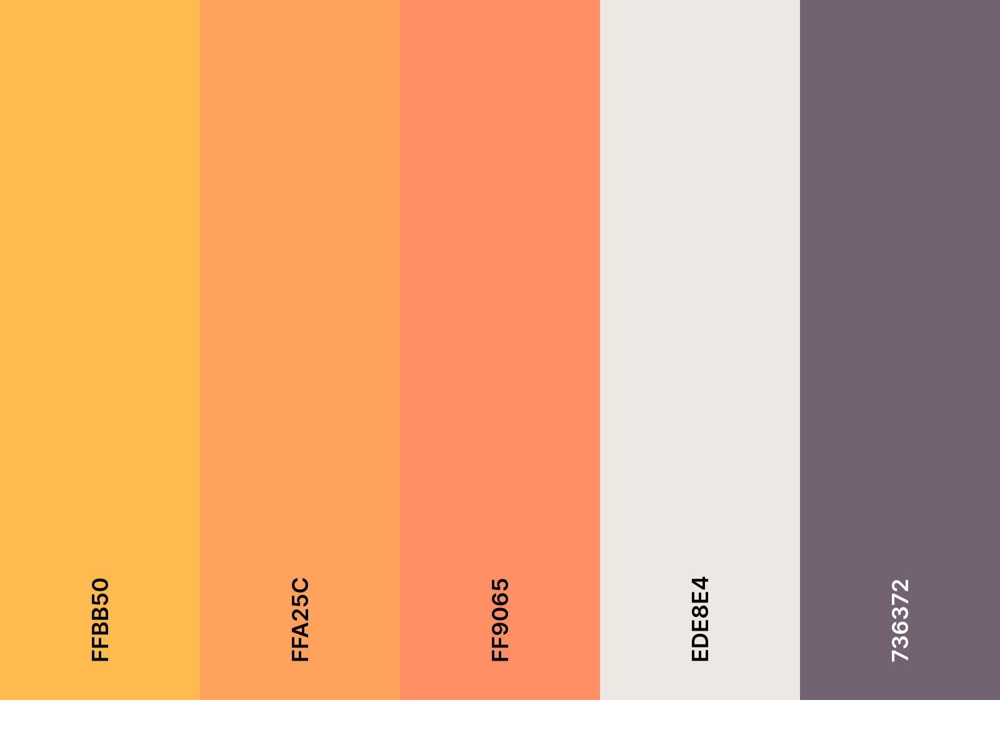
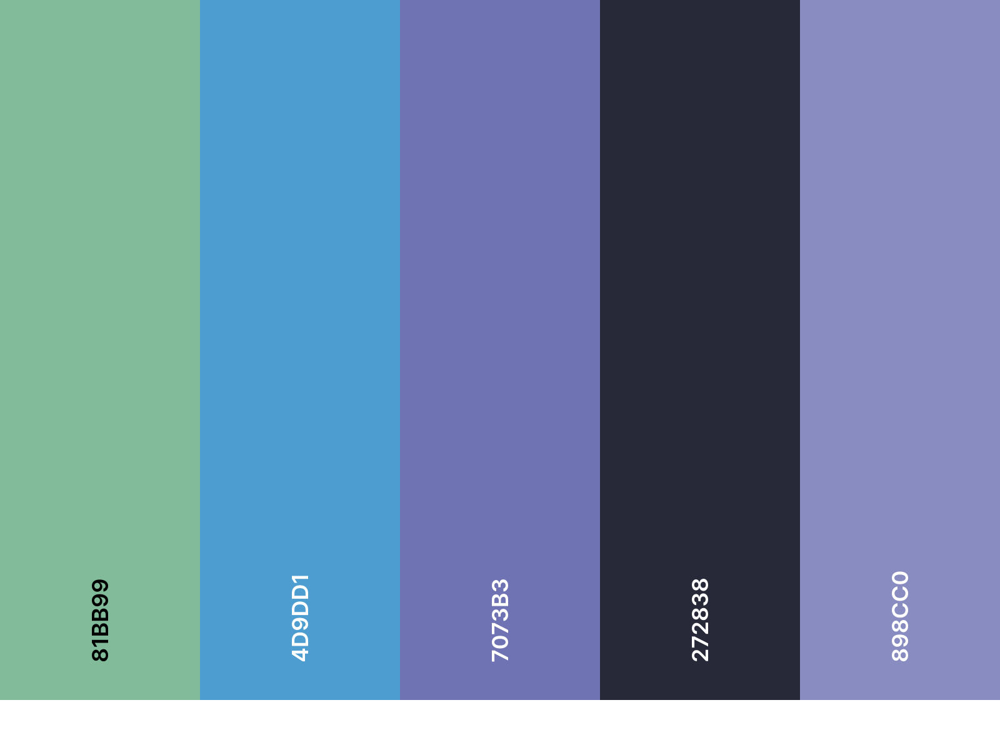

# Template branding & UI

!!! tip "Content"
    This page holds details about the general branding rules I used for this template to have the UI match assets colors.

## Colors

### Dark mode palette

!!! quote "Dark mode color palette"

     `FFBB50` :fontawesome-regular-copy:

     `FFA25C` :fontawesome-regular-copy:

     `FF9065` :fontawesome-regular-copy:

     `EDE8E4` :fontawesome-regular-copy:

     `736372` :fontawesome-regular-copy:

<!-- 
/// caption 
/// -->

### Light mode palette click color to copy rgb value

!!! quote "Light mode color palette"

     `81BB99` :fontawesome-regular-copy:

     `4D9DD1` :fontawesome-regular-copy:

     `7073B3` :fontawesome-regular-copy:

     `272838` :fontawesome-regular-copy:

     `C5EEE0` :fontawesome-regular-copy:
<!-- 

/// caption 
/// -->

## Gradients

### Dark mode gradient

[`Coolors link`](https://coolors.co/ffbb50-ffa25c-ff9065-ede8e4-736372)

{ width=95% }
/// caption
Color palette for dark theme UI
///

### Light mode gradient

[`Coolors link`](https://coolors.co/81bb99-4d9dd1-7073b3-272838-898cc0)

{ width=95% }
/// caption
Color palette for light theme UI
///

## Branding fonts

