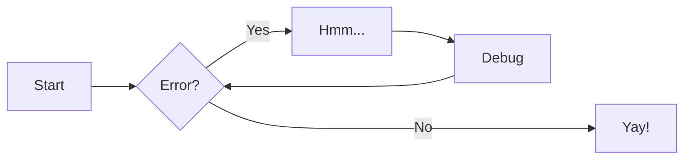

{ width="300" }
{ width="300" }
/// caption
///

[Send :fontawesome-solid-paper-plane:](#){ .md-button } [Subscribe to our newsletter](#){ .md-button .md-button--primary }

For full documentation visit [zensical.org](https://zensical.org/docs/).

???+ tip "Design references :lucide-globe:"
    
    === "UI design"
        - [Inkscape](https://inkscape.org/) - Open source vector graphics editor. 
        [<span style="color: #e49a45; opacity: 0.8; font-size: 15px">:fontawesome-brands-square-gitlab::fontawesome-brands-git-alt:</span>](https://gitlab.com/inkscape/inkscape)
        - [Beautifycode](https://codebeautify.org/svg-formatter-beautifier#) - Online code formatting & minifying tool with SVG support.
        - [Font Awesome](https://fontawesome.com/) - Web icon library & toolkits. [:fontawesome-brands-github::fontawesome-brands-git-alt:](https://github.com/FortAwesome/Font-Awesome)
        - [CSS Gradients](https://cssgradient.io/) - An open source CSS gradients editor, library & tool collection.
        - [Lucid icons](https://lucide.dev/icons/) - Web icon library.
        - [Haikei](http://app.haikei.app/) - Free svg generation tools

    === "Fonts"
        - [Google fonts](https://fonts.google.com/) - Open source fonts from Google.  [:fontawesome-brands-github::fontawesome-brands-git-alt:](https://github.com/google/fonts)
        - [FontVS](https://fontvs.com/) - Online preview tool for local & online fonts with custom options/variants.

{ width="300" }
{ width="300" }
/// caption
///

## Commands

* [`zensical new`][new] - Create a new project
* [`zensical serve`][serve] - Start local web server
* [`zensical build`][build] - Build your site

  [new]: https://zensical.org/docs/usage/new/
  [serve]: https://zensical.org/docs/usage/preview/
  [build]: https://zensical.org/docs/usage/build/

## Examples

### Admonitions

> Go to [documentation](https://zensical.org/docs/authoring/admonitions/)

!!! note

    This is a **note** admonition. Use it to provide helpful information.

!!! warning

    This is a **warning** admonition. Be careful!

### Details

> Go to [documentation](https://zensical.org/docs/authoring/admonitions/#collapsible-blocks)

??? info "Click to expand for more info"
    
    This content is hidden until you click to expand it.
    Great for FAQs or long explanations.

## Code Blocks

> Go to [documentation](https://zensical.org/docs/authoring/code-blocks/)

``` python hl_lines="2" title="Code blocks"
def greet(name):
    print(f"Hello, {name}!") # (1)!

greet("Python")
```

1.  > Go to [documentation](https://zensical.org/docs/authoring/code-blocks/#code-annotations)

    Code annotations allow to attach notes to lines of code.

Code can also be highlighted inline: `#!python print("Hello, Python!")`.

## Content tabs

> Go to [documentation](https://zensical.org/docs/authoring/content-tabs/)

=== "Python"

    ``` python
    print("Hello from Python!")
    ```

=== "Rust"

    ``` rs
    println!("Hello from Rust!");
    ```

## Diagrams

> Go to [documentation](https://zensical.org/docs/authoring/diagrams/)



## Footnotes

> Go to [documentation](https://zensical.org/docs/authoring/footnotes/)

Here's a sentence with a footnote.[^1]

Hover it, to see a tooltip.

[^1]: This is the footnote.


## Formatting

> Go to [documentation](https://zensical.org/docs/authoring/formatting/)

- ==This was marked (highlight)==
- ^^This was inserted (underline)^^
- ~~This was deleted (strikethrough)~~
- H~2~O
- A^T^A
- ++ctrl+alt+del++

## Icons, Emojis

> Go to [documentation](https://zensical.org/docs/authoring/icons-emojis/)

* :sparkles: `:sparkles:`
* :rocket: `:rocket:`
* :tada: `:tada:`
* :memo: `:memo:`
* :eyes: `:eyes:`

## Maths

> Go to [documentation](https://zensical.org/docs/authoring/math/)

$$
\cos x=\sum_{k=0}^{\infty}\frac{(-1)^k}{(2k)!}x^{2k}
$$

!!! warning "Needs configuration"
    Note that MathJax is included via a `script` tag on this page and is not
    configured in the generated default configuration to avoid including it
    in a pages that do not need it. See the documentation for details on how
    to configure it on all your pages if they are more Maths-heavy than these
    simple starter pages.

<script id="MathJax-script" async src="https://unpkg.com/mathjax@3/es5/tex-mml-chtml.js"></script>
<script>
  window.MathJax = {
    tex: {
      inlineMath: [["\\(", "\\)"]],
      displayMath: [["\\[", "\\]"]],
      processEscapes: true,
      processEnvironments: true
    },
    options: {
      ignoreHtmlClass: ".*|",
      processHtmlClass: "arithmatex"
    }
  };
</script>

## Task Lists

> Go to [documentation](https://zensical.org/docs/authoring/lists/#using-task-lists)

* [x] Install Zensical
* [x] Configure `zensical.toml`
* [x] Write amazing documentation
* [ ] Deploy anywhere

## Tooltips

> Go to [documentation](https://zensical.org/docs/authoring/tooltips/)

[Hover me][example]

  [example]: https://example.com "I'm a tooltip!"
